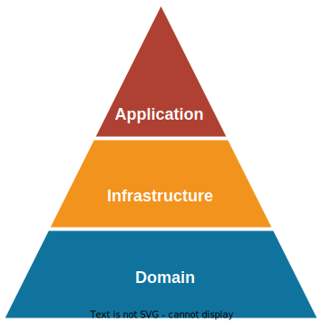
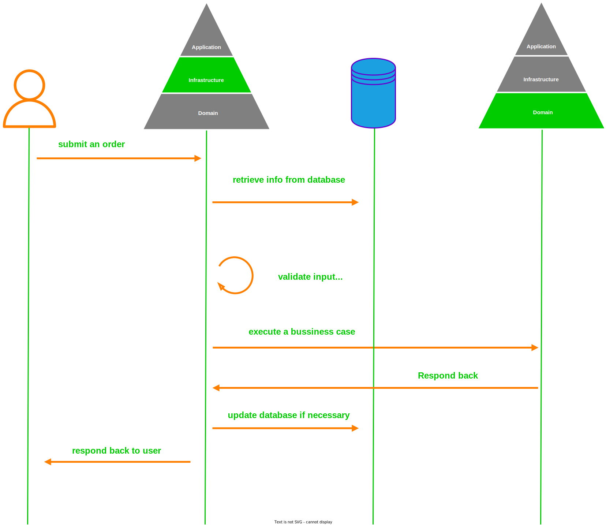

# Getting Started

This is a demo project to demonstrate the concept of DDD (Domain Driven Design) 
within a monolithic web application.

## DDD in a nutshell

<blockquote><p>You cannot create a banking software system unless you have a good understanding about the domain of banking.</p>
<p>Domain Driven Design - by Eric Evans.</p>
</blockquote>

<p align="center">

</p>


Our Application usually consists of three layers:
1. **Domain layer** includes all the business functionalities/code and rules.  
2. **Infrastructure layer** supports communication between the domain and other components/layers.  
Infrastructure layer is an expression/implementation for the domain layer — 
a way of conducting/executing business information described on domain layer.
Yes, Domain layer is like a java interface, and infrastructure layer is its implementation.  
We express business information through services.  
Services are built using contracts — a way of abstracting business information.
So that for each service, there’s a contract and one or more implementations.  
Contracts like [Adapters - a well-known design pattern] are placed within the domain layer, 
while their implementations are placed within the infrastructure layer.  
Most importantly, the domain layer is in the center of the business application. 
This means that it should be separated from the rest of the layers. 
It shouldn’t depend on the other layers or their frameworks. 
Contracts (adapters) implementations should NOT contain any business logic. 
All operations with Domain objects should be initiated and encapsulated only in domain module. 
So, you can utilize Utils/Tools/Handlers built within domain layer.  
3. **Application layer** a point of control that manages a combination of both previous layers.  
On this project you'll find it encapsulating spring boot configuration properties.   
In general for dependencies in a DDD Service, the Application layer depends on Domain and Infrastructure, 
and Infrastructure depends on Domain, but Domain doesn't depend on any layer / The other way around is not permitted.  
Think about it this way - What is more likely to be replaced at some point? Infrastructure or domain?
Infrastructure will change over time (different providers, different servers, …), 
Your domain on the other hand will always be there.

## Example at hand
1. An order is placed like below:  

  ```json
  {
  "content": "Dummy Order",
  "user": 1,
  "address": 3,
  "order": {
    "lineItems": [
      {
        "product": 1,
        "quantity": 5
      },
      {
        "product": 2,
        "quantity": 3
      }
    ],
    "payment": 1500.5
  }
}
  ```
2. This request will be validated on the infrastructure layer before proceeding to the domain layer;
As we're going to check for the availability of those items,
   along with their quantities, and lastly the payment amount.
3. The retrieved information will constitute the input for our domain layer.
4. After the business case is executed, the domain layer will respond back to the infrastructure layer.
5. Still, we can perform some processes on the infrastructure layer before coming back to the client.
<p align="center">

</p>

## Useful Concepts
### Aggregates
* For each business feature delivered, it can be wrapped within what’s called a **BoundedContext**.
* To use Aggregates, please read this article offered by [Bealdung](https://baeldung-cn.com/java-modules-ddd-bounded-contexts).
* Aggregate Root is the mothership entity inside the aggregate.
* It identifies a transaction boundary so that an aggregate root and all related boundaries 
should be modified following strong consistency principle (oppose to domain events 
and eventual consistency for cross-aggregation root changes).

### Ubiquitous language
People working within a context use a language of their own, and some things expressed differently from one context to another.  
Example: On a bookstore app, the book is expressed differently on `Warehouse` context and `Shipping` context.  
- On `Shipping`, it will have address and some shipping details.
- On `Warehouse`, it will have ISBN, author, category ...etc.  

On this Example: The Customer is expressed differently on `ShippingProcess`
 context and `CustomerOrder` context.
- On `ShippingProcess`, it has just an id and name.
- On `CustomerOrder`, it will have id, firstName, lastName ...etc.

## Examples covered in this demo
### 1. Communication between layers
On this demo we'll try to execute a simple business case of submitting an order,
which will be initially handled by the infrastructure layer,
and then passed to the domain layer to be processed (Where business happens),
then return the result back to the infrastructure layer.

### 2. Event-Driven
Using a simple event bus implementation, we can communicate events & data across the application from bounded contexts.
## Deployment notes
This project uses embedded DB: [h2-console](http://localhost:8081/h2-console).  
You can test via requests found on this [postman collections file](ddd.postman_collection.json).
## Authors
[](https://linkedin.com/in/zatribune)

